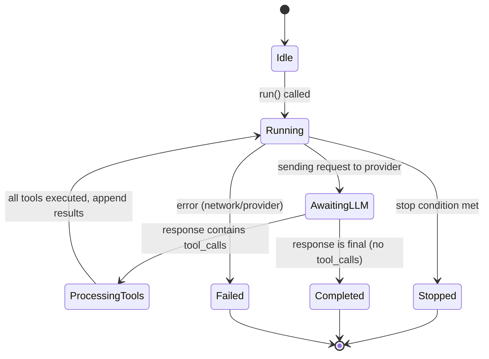

> ⚠️ **Pre-release notice:** v0.4.0 is a beta and may be unstable. APIs are subject to change without notice.

Agent loop engine for multi-turn conversations.

---

## Overview

`claw-loop` manages the conversation lifecycle:
- Message history
- Tool call loops
- Stop conditions
- Context window management

---

## Usage

```toml
[dependencies]
claw-loop = "0.1"
```

```rust
use claw_loop::AgentLoopBuilder;
use claw_provider::AnthropicProvider;
use claw_tools::ToolRegistry;
use std::sync::Arc;

let provider = Arc::new(AnthropicProvider::from_env()?);
let tools = Arc::new(ToolRegistry::new());

let agent = AgentLoopBuilder::new()
    .with_provider(provider)
    .with_tools(tools)
    .with_max_turns(10)
    .build()?;

let response = agent.run("Hello!").await?;
```

---

## Configuration

```rust
let agent = AgentLoopBuilder::new()
    // Provider (required)
    .with_provider(my_provider)
    // Tools (optional)
    .with_tools(tool_registry)
    // System prompt
    .with_system_prompt("You are a helpful assistant.")
    // Stop conditions
    .with_max_turns(10)
    .with_token_budget(8000)
    .build()?;
```

---

## Stop Conditions

```rust
use claw_loop::AgentLoopBuilder;

let agent = AgentLoopBuilder::new()
    .with_max_turns(10)        // Stop after 10 turns
    .with_token_budget(8000)   // Stop when total tokens ≥ 8000 (0 = unlimited)
    .build()?;
```

Built-in stop conditions (configured via builder methods):
- `.with_max_turns(n)` — Stop after n turns
- `.with_token_budget(n)` — Stop when total tokens ≥ n (0 = unlimited)
- `NoToolCall` — Loop handles this exit path directly when LLM returns no tool calls

Custom stop conditions can be implemented using the `StopCondition` trait:

```rust
use claw_loop::{StopCondition, LoopState};

pub struct MyCondition;

impl StopCondition for MyCondition {
    fn should_stop(&self, state: &LoopState) -> bool {
        state.turn > 5 && state.history_len > 10
    }
    
    fn name(&self) -> &str {
        "my_condition"
    }
}
```

---

## History Management

```rust
use claw_loop::SqliteHistory;

// Persistent history
let history = SqliteHistory::connect("./conversation.db").await?;

let agent = AgentLoopBuilder::new()
    .with_history(history)
    .build()?;
```

---

## Streaming Responses

```rust
let mut stream = agent.stream_run("Hello!").await?;

while let Some(chunk) = stream.next().await {
    match chunk {
        StreamChunk::Text { content, is_final } => print!("{}", content),
        StreamChunk::ToolStart { id, name } => println!("\n[Using tool: {}]", name),
        StreamChunk::ToolComplete { id, result } => println!("[Tool done]"),
        StreamChunk::ToolError { id, error } => eprintln!("[Tool error: {}]", error),
        StreamChunk::UsageUpdate(usage) => println!("[Tokens: {}]", usage.total_tokens),
        StreamChunk::Finish(reason) => println!("[Finished: {:?}]", reason),
        StreamChunk::Error(msg) => eprintln!("[Error: {}]", msg),
    }
}
```

---

## Multi-Turn Conversation

```rust
use claw_loop::{AgentLoopBuilder, InMemoryHistory};

// Create agent with history
let history = InMemoryHistory::new(4096); // 4K token limit
let agent = AgentLoopBuilder::new()
    .with_history(history)
    .build()?;

// Preserves context between calls
let response1 = agent.run("My name is Alice.").await?;
let response2 = agent.run("What's my name?").await?; // "Alice"
```

---

## Agent Loop State Machine



## Tool Execution Concurrency Model

Tools are executed **concurrently** using `tokio::JoinSet`. All tool calls in a
single LLM response run in parallel. Results are collected and appended to history
in the order they were requested (not completion order) for deterministic output.

## Retry and Error Recovery

- Network errors: retried up to 3 times with exponential backoff (1s, 2s, 4s)
- Tool errors: NOT retried; the error message is passed back to the LLM
- Provider rate limits (429): retried with Retry-After header respect
